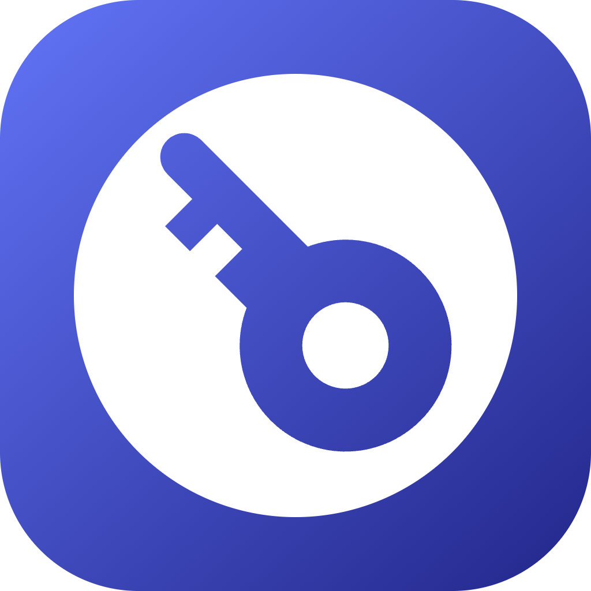

<div align="center">



# Portunus

**A local-first, zero-knowledge password manager for Windows and macOS.**

Your vault never leaves your machine. No accounts, no servers, no telemetry.

[](https://github.com/JoaoVitorJJV/portunus/actions/workflows/release.yml)
[](https://github.com/JoaoVitorJJV/portunus/releases/latest)
[](LICENSE)

[](https://dotnet.microsoft.com/)
[](https://avaloniaui.net/)
[](#installation)
[](CONTRIBUTING.md)

[Download](#installation) · [Security model](#security-model) · [Build from source](#build-and-run) · [Contributing](#contributing)

</div>

---

## What is Portunus?

Portunus is a desktop password manager built on a simple premise: **the only person who can read your vault is you.**

Everything is encrypted locally with a key derived from your master password. There is no backend, no sync service, no account to create, and no "forgot password" link — because there is nobody on the other side who could help you. The encrypted `.vault` file on your disk is the whole product.

If you want your passwords on a second machine, you copy the file there and unlock it with your master password. That's the entire sync story, and it's deliberate.

Portunus is **free and open source** under the [MIT license](LICENSE). The cryptography, the storage format, and the UI are all in this repository — audit them, fork them, or build your own.

### Why another password manager?

Most good password managers are either closed source, cloud-first, or both. Portunus targets the narrow gap in between: something that looks and feels like a modern app, but whose threat model assumes the network is hostile and the vendor (that's us) should never be trusted with anything.

---

## Features

| | |
|---|---|
| 🔐 **Zero-knowledge encryption** | Argon2id key derivation + AES-256-GCM authenticated encryption |
| 💾 **Local-first** | A single `.vault` file. No account, no server, no sync daemon |
| 🗂️ **Structured entries** | Logins, cards, secure notes, identities, Wi-Fi credentials |
| 🏷️ **Categories, tags & multiple vaults** | Organize the way you actually think |
| 🛟 **Recovery codes** | Store 2FA backup codes next to the login they belong to |
| ⚡ **PIN & biometric unlock** | Optional, per-device, backed by DPAPI (Windows) and Keychain (macOS) |
| 🎨 **Sálvia & Grafite themes** | Light and dark, both first-class |
| 🌍 **Cross-platform** | One codebase, native builds for Windows and macOS |
| 📦 **Auto-updating installers** | Signed, versioned releases via Velopack |

---

## Security model

Portune's security posture is intentionally boring. Boring is good.

```
master password
      │
      ▼
   Argon2id  ──(salt + memory/iteration params, stored in the file header)
      │
      ▼
  256-bit key ────────────► lives in RAM only, zeroed on dispose
      │
      ▼
  AES-256-GCM
      │
      ▼
  vault.vault
```

**Vault file layout**

```
┌─────────┬──────┬────────────────┬───────┬─────────┬────────────────────┐
│ version │ salt │ Argon2id params│ nonce │ GCM tag │ ciphertext (JSON)  │
└─────────┴──────┴────────────────┴───────┴─────────┴────────────────────┘
```

The plaintext inside is a JSON document (`VaultDocument`) holding entries, tags, categories and vaults. Everything sensitive — including metadata like entry titles and vault names — lives **inside** the encrypted blob. Only genuinely non-sensitive per-device state (theme, window size) is written to a plain `settings.json`.

**Key properties**

- The derived key exists only in memory while the vault is unlocked, and is wiped with `CryptographicOperations.ZeroMemory` on dispose.
- A fresh nonce is generated on **every** save. The key and salt are reused, so Argon2id is never re-run on a save path.
- Writes are atomic: the new file is written to `.tmp` and then moved over the original. A crash mid-save cannot corrupt your vault.
- Wrong password is detected by GCM tag failure — there is no separate "password check" value to attack.
- PIN and biometric unlock store the key in the OS keychain, **bound to that device**. After a configurable number of failed PIN attempts the keychain entry is forgotten and the master password is required again.
- The master password is always the universal fallback, and importing a vault on a new device always requires it.

> [!WARNING]
> **There is no recovery.** If you forget your master password, the vault is unopenable — by you, by us, by anyone. This is not a limitation we plan to fix; it is the product.

---

## Installation

Download the latest installer for your platform from the [Releases page](https://github.com/JoaoVitorJJV/portunus/releases/latest).

| Platform | File | Notes |
|---|---|---|
| Windows 10/11 (x64) | `Portunus-win-Setup.exe` | Installs per-user, auto-updates |
| macOS 15+ (Apple Silicon) | `Portunus-osx-Setup.pkg` | Auto-updates |

Prefer to build it yourself? See below.

---

## Build and run

### Prerequisites

- [.NET 10 SDK](https://dotnet.microsoft.com/download) — verify with `dotnet --version`
- **Windows:** Visual Studio 2026 (Community is fine) with the *.NET desktop development* workload
- **macOS:** VS Code with the [C# Dev Kit](https://marketplace.visualstudio.com/items?itemName=ms-dotnettools.csdevkit) and [Avalonia](https://marketplace.visualstudio.com/items?itemName=AvaloniaTeam.vscode-avalonia) extensions

```bash
git clone https://github.com/JoaoVitorJJV/portunus.git
cd portunus
```

### Option A — Visual Studio 2026 (Windows)

1. Open `Portunus.sln`.
2. Let NuGet restore finish (Visual Studio does this automatically on load; otherwise **Build → Restore NuGet Packages**).
3. In Solution Explorer, right-click **`Portunus.App`** → **Set as Startup Project**.
4. Press <kbd>F5</kbd> to run with the debugger, or <kbd>Ctrl</kbd>+<kbd>F5</kbd> to run without it.

The Avalonia XAML previewer works out of the box for views under `Portunus.App/Views`. If the previewer shows a stale design, do a **Build → Rebuild Solution** — the previewer renders against the compiled assembly.

> `Portunus.Platform` multi-targets `net10.0-windows` and `net10.0-macos15.0`. On Windows only the Windows target builds; the macOS target is excluded by MSBuild conditionals, so you can safely ignore it in the IDE.

### Option B — .NET CLI (Windows, macOS)

```bash
# restore dependencies
dotnet restore

# build the whole solution
dotnet build

# run the desktop app
dotnet run --project src/Portunus.App
```

Useful variations:

```bash
# release build
dotnet build -c Release

# run with a specific configuration
dotnet run --project src/Portunus.App -c Release

# watch mode — rebuilds and restarts on file change
dotnet watch --project src/Portunus.App

# clean everything
dotnet clean
```

**Publishing a self-contained build**

```bash
# Windows
dotnet publish src/Portunus.App -c Release -r win-x64 --self-contained -o publish/win

# macOS (Apple Silicon)
dotnet publish src/Portunus.App -c Release -r osx-arm64 --self-contained -o publish/osx
```

---

## Testing

The crypto and vault logic live in `Portunus.Core`, which has no UI or OS dependencies and is covered by a dedicated test project.

```bash
# run every test in the solution
dotnet test

# run only the core tests
dotnet test tests/PasswordVault.Core.Tests

# verbose output, one line per test
dotnet test -v normal

# filter by name
dotnet test --filter "FullyQualifiedName~VaultSession"

# collect code coverage (Cobertura XML under TestResults/)
dotnet test --collect:"XPlat Code Coverage"
```

In Visual Studio: **Test → Test Explorer**, then **Run All Tests** (<kbd>Ctrl</kbd>+<kbd>R</kbd>, <kbd>A</kbd>).

### What's covered

| Area | Cases |
|---|---|
| **Round-trip** | Create → save → unlock → read returns an identical document |
| **Wrong password** | `TryUnlock` returns `false` (GCM tag failure), never throws |
| **Missing file** | `TryUnlock` throws `FileNotFoundException` — a distinct signal from "wrong password", so the UI can route to first-run instead of an error |
| **Key hygiene** | Key material is zeroed on dispose; `Save()` never re-derives via Argon2 |
| **Nonce freshness** | Two saves of identical content produce different ciphertext |
| **Referential integrity** | Deleting a tag or category clears the dangling references on every entry |
| **Multi-vault isolation** | Entries in one vault never leak into another |
| **Atomic writes** | An interrupted save leaves the previous vault intact |

New crypto or vault-mutation code is expected to ship with tests. UI code is not unit-tested — that's a deliberate trade-off, not an oversight.

---

## Project structure

```
portunus/
├── src/
│   ├── Portunus.Core/          # crypto, vault logic, models, JSON serialization
│   │   ├── Crypto/             #   KeyDerivation (Argon2id), VaultCipher (AES-GCM), Envelope
│   │   ├── Models/             #   VaultDocument, PasswordEntry, Category, PasswordTag, Vault
│   │   └── VaultSession.cs     #   unlock/save/mutate lifecycle, IDisposable
│   │
│   ├── Portunus.Platform/      # OS-specific key storage behind IKeyStore
│   │   ├── Windows/            #   WindowsKeyStore (DPAPI)
│   │   ├── Mac/                #   MacKeyStore (Keychain)
│   │   └── NullKeyStore.cs     #   fallback when no secure store is available
│   │
│   └── Portunus.App/           # Avalonia UI, MVVM, composition root
│       ├── Views/              #   AXAML views
│       ├── ViewModels/         #   CommunityToolkit.Mvvm view models
│       ├── Services/           #   NavigationService, NotificationService, VaultService
│       └── Styles/             #   Palette.axaml (themes), Controls.axaml (class styles)
│
└── tests/
    └── PasswordVault.Core.Tests/
```

**Dependency direction is strictly one-way:** `Core` ← `Platform` ← `App`. Core knows nothing about the UI or the operating system, which is exactly what makes it testable.

### Stack

| Concern | Choice |
|---|---|
| Key derivation | [`Konscious.Security.Cryptography`](https://github.com/kmaragon/Konscious.Security.Cryptography) (Argon2id) |
| Encryption | `System.Security.Cryptography` (AES-256-GCM) |
| OS key storage | DPAPI (Windows) · Keychain (macOS) |
| UI | [Avalonia 11.3 LTS](https://avaloniaui.net/) + [FluentAvalonia](https://github.com/amwx/FluentAvalonia) |
| MVVM | [CommunityToolkit.Mvvm](https://learn.microsoft.com/dotnet/communitytoolkit/mvvm/) |
| Icons | Projektanker.Icons.Avalonia + FontAwesome |
| DI | `Microsoft.Extensions.DependencyInjection` |
| Serialization | `System.Text.Json` |
| Packaging & updates | [Velopack](https://velopack.io/) |
| CI | GitHub Actions |

---

## Releases

Releases are cut by tagging. The version is `major.minor.patch`, with a fourth segment appended automatically from the CI run number:

```bash
git tag v1.1.0
git push origin v1.1.0
```

GitHub Actions then builds both platforms, injects the version via `-p:Version=`, packs installers with `vpk`, and attaches them to the release. macOS builds are gated on release tags to keep runner minutes in check.

---

## Roadmap

- [x] Core crypto layer with full test coverage
- [x] Windows key store (DPAPI)
- [x] Three-column dashboard, entry editor, notifications
- [ ] macOS key store (Keychain)
- [ ] Complete GitHub Actions matrix build
- [ ] Code signing for both platforms
- [ ] Internationalization (the architecture already keeps UI strings out of Core)
- [ ] Password health / "Sentinela" audit view
- [ ] Browser extension companion

---

## Contributing

Contributions are welcome. Because this is security software, a few things matter more than usual:

1. **Open an issue before large changes.** Especially anything touching `Portunus.Core`.
2. **Never weaken the crypto path** to make something more convenient. Convenience belongs in the UI layer.
3. **Tests accompany logic.** Anything in Core that can be tested, should be.
4. **Respect the dependency direction.** If a change requires `Core` to know about Avalonia, the design is wrong.
5. **Keep colors in `Palette.axaml`.** No hard-coded hex values in views.

```bash
git checkout -b feature/your-thing
dotnet test          # must be green
git commit -m "feat: your thing"
```

Found a security issue? Please **do not open a public issue** — email the address in [SECURITY.md](SECURITY.md) instead.

---

## FAQ

**Can I sync between devices?**
Manually. Export the encrypted `.vault` file, move it however you like (USB, your own cloud drive, whatever), and import it on the other machine. Import always requires the master password.

**Can Portunus recover my vault if I forget the master password?**
No. Not "no, but there's a workaround" — no. The key is derived from your password and nothing else.

**Is it audited?**
Not yet. It's open source specifically so you can look. Treat it accordingly until it is.


---

## License

[MIT](LICENSE) © João

---

<div align="center">
<sub>Built with .NET and Avalonia. No cloud, no accounts, no compromise.</sub>
</div>
